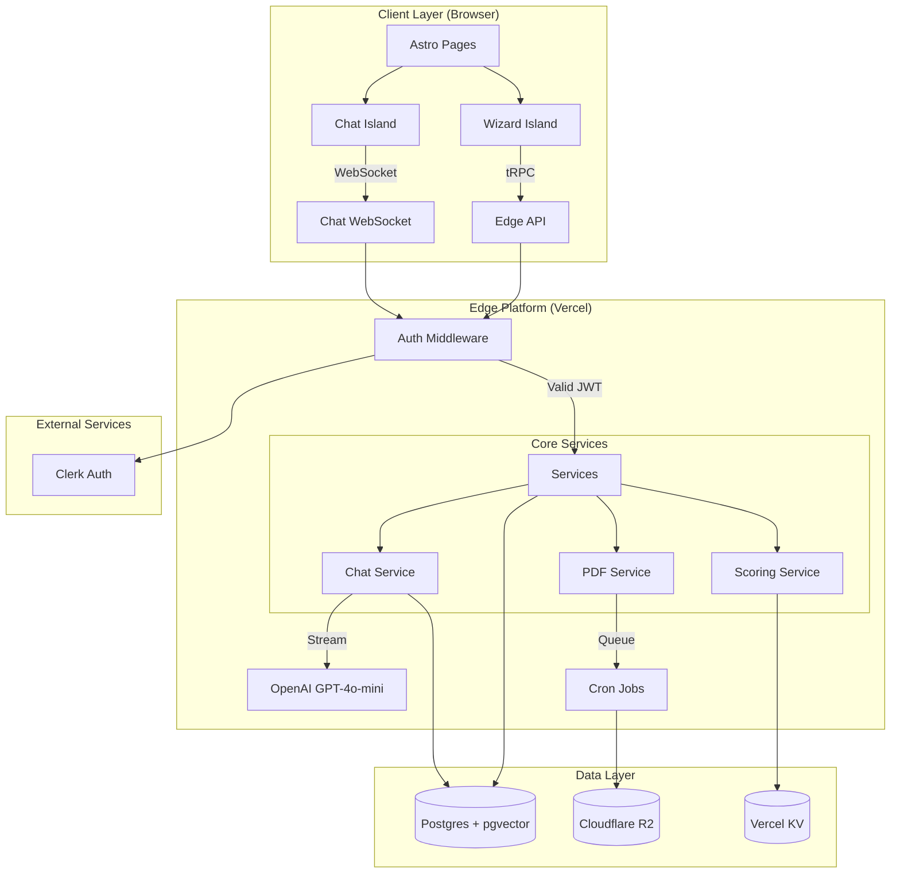

# Agent Readiness Audit (ARA) - Documentation Index

**A wizard-first web application with embedded mini-chat for agent readiness assessment**

---

## 📁 Project Documentation

### Core Documentation
- **[Technical Requirements Document (TRD)](./resources/TRD.md)** - Complete technical specifications
- **[System Design](./resources/ARA-System-Design.md)** - Detailed architecture and implementation design
- **[Development Estimation](./resources/ARA-Development-Estimation.md)** - Project timeline and cost analysis

### Quick Reference
- **[API Reference](./docs/api-reference.md)** - tRPC endpoints and schemas
- **[Setup Guide](./docs/setup-guide.md)** - Development environment setup
- **[Architecture Decisions](./docs/architecture-decisions.md)** - Key design decisions and rationale
- **[Deployment Guide](./docs/deployment-guide.md)** - Production deployment instructions

---

## 🏗️ System Architecture



---

## 🔧 Tech Stack

| Layer | Technology | Purpose |
|-------|------------|---------|
| **Frontend** | Astro v4 + React 18 | Static site generation with interactive islands |
| **Styling** | Tailwind CSS + DaisyUI | Utility-first styling with component library |
| **State** | Zustand + TanStack Query | Client state management and data fetching |
| **API** | tRPC + Vercel Edge | Type-safe API with edge runtime |
| **Auth** | Clerk | Authentication and user management |
| **Database** | Postgres + pgvector | Relational data with vector embeddings |
| **AI** | OpenAI GPT-4o-mini | Chat assistance and content generation |
| **Storage** | Cloudflare R2 | Object storage for PDF reports |
| **Deployment** | Vercel + Terraform | Serverless deployment with IaC |

---

## 🚀 Quick Start

### Prerequisites
- Node.js 20+
- PostgreSQL 15+ with pgvector extension
- Clerk account for authentication
- OpenAI API key

### Environment Setup
```bash
# Clone repository
git clone [repository-url]
cd appstoagents-ara

# Install dependencies
npm install

# Copy environment template
cp .env.example .env

# Configure environment variables
# DATABASE_URL, CLERK_SECRET_KEY, OPENAI_API_KEY, etc.

# Setup database
npx prisma migrate dev
npx prisma db seed

# Start development server
npm run dev
```

**Detailed setup instructions**: [Setup Guide](./docs/setup-guide.md)

---

## 📋 Key Features

### Wizard Interface
- **8-step progressive workflow** with auto-save functionality
- **Mobile-responsive design** with swiper panels
- **Real-time validation** and progress tracking
- **Accessibility compliant** (WCAG 2.2 AA)

### Embedded Chat
- **Context-aware assistance** tied to current wizard step
- **Streaming responses** from OpenAI GPT-4o-mini
- **Autofill suggestions** with user acceptance workflow
- **WebSocket connection** for real-time interaction

### Authentication & Session Management
- **Guest mode** with anonymous session tracking
- **Seamless conversion** from guest to authenticated user
- **Session persistence** across browser sessions
- **JWT-based security** with automatic token refresh

### Scoring & Reporting
- **Multi-pillar scoring** with configurable weights
- **Real-time score calculation** during wizard completion
- **PDF report generation** with queue management
- **Secure report delivery** via signed URLs

---

## 🔐 Security Features

- **End-to-end encryption** for PII data
- **Rate limiting** on all API endpoints
- **OWASP ASVS Level 1** compliance
- **SOC 2 Type II** controls implementation
- **Regular security scanning** with Snyk

---

## 📊 Performance Targets

| Metric | Target | Current |
|--------|--------|---------|
| API p95 latency | < 250ms | TBD |
| Chat first token | < 1s | TBD |
| Concurrent sessions | 1,000 | TBD |
| PDF generation | ≥ 30/min | TBD |

---

## 🧪 Testing Strategy

| Type | Framework | Coverage Target |
|------|-----------|----------------|
| **Unit** | Vitest | ≥ 80% critical paths |
| **Component** | Playwright CT | All wizard & chat states |
| **API** | Supertest | All tRPC routes |
| **E2E** | Playwright | Guest → signup → PDF flow |
| **Load** | K6 | 1k RPS sustained |

---

## 📈 Development Estimates

| Phase | Duration | Team Size | Confidence |
|-------|----------|-----------|------------|
| **Core Development** | 280-320 hours | 2-3 developers | 80% |
| **Testing & QA** | 50-60 hours | | 75% |
| **Integration & Polish** | 65-75 hours | | 70% |
| **Total** | **395-455 hours** | | **75%** |

**Timeline**: 6-10 weeks with 2-3 developer team

---

## 🔄 Development Workflow

### Branch Strategy
- `main` - Production-ready code
- `develop` - Integration branch for features
- `feature/*` - Individual feature branches
- `hotfix/*` - Critical production fixes

### Deployment Pipeline
1. **Feature development** on feature branches
2. **Pull request** with automated checks (lint, test, type-check)
3. **Preview deployment** on Vercel
4. **Code review** and approval
5. **Merge to develop** for integration testing
6. **Deploy to staging** for final validation
7. **Merge to main** and deploy to production

---

## 📚 Additional Resources

### Documentation
- [API Reference](./docs/api-reference.md) - Complete API documentation
- [Component Library](./docs/components.md) - Reusable component documentation
- [Database Schema](./docs/database.md) - Data model and relationships
- [Security Guidelines](./docs/security.md) - Security implementation details

### Development
- [Coding Standards](./docs/coding-standards.md) - Code style and conventions
- [Testing Guide](./docs/testing.md) - Testing strategies and examples
- [Performance Guide](./docs/performance.md) - Optimization best practices
- [Troubleshooting](./docs/troubleshooting.md) - Common issues and solutions

### Operations
- [Monitoring & Alerts](./docs/monitoring.md) - Observability setup
- [Backup & Recovery](./docs/backup.md) - Data protection procedures
- [Scaling Guide](./docs/scaling.md) - Performance scaling strategies
- [Incident Response](./docs/incident-response.md) - Emergency procedures

---

## 🤝 Contributing

1. Fork the repository
2. Create a feature branch (`git checkout -b feature/amazing-feature`)
3. Follow coding standards and add tests
4. Commit changes (`git commit -m 'Add amazing feature'`)
5. Push to branch (`git push origin feature/amazing-feature`)
6. Open a Pull Request

---

## 📄 License

This project is proprietary software owned by AppstoAgents.

---

## 🆘 Support

- **Documentation Issues**: Create an issue in this repository
- **Technical Support**: Contact the development team
- **Emergency Issues**: Use the incident response procedures

---

*Last Updated: July 20, 2025*
*Generated by SuperClaude `/sc:index` command*