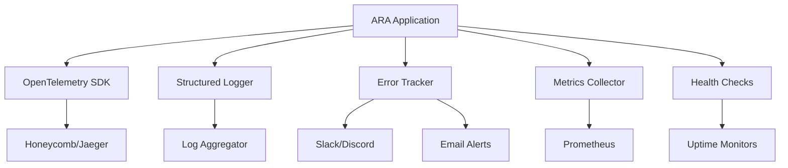

# Monitoring Setup Guide - Task 3.4

Comprehensive monitoring and observability implementation for the ARA Assessment System.

## 🎯 Overview

This monitoring setup provides:
- **OpenTelemetry Integration**: Distributed tracing across services
- **Structured Logging**: Contextual logging with correlation IDs
- **Error Tracking**: Automatic error detection and alerting
- **Performance Monitoring**: Real-time metrics and threshold alerting
- **Health Checks**: Uptime monitoring with dependency validation

## 📊 Architecture



## 🚀 Quick Start

### 1. Environment Configuration

Copy the monitoring environment template:
```bash
cp .env.monitoring.example .env.local
```

Configure your monitoring endpoints:
```env
# OpenTelemetry (Honeycomb recommended)
OTEL_EXPORTER_OTLP_ENDPOINT="https://api.honeycomb.io/v1/traces"
OTEL_API_KEY="your_honeycomb_api_key"

# Error Alerts
SLACK_ERROR_WEBHOOK="https://hooks.slack.com/services/..."
ERROR_ALERT_EMAIL="alerts@yourdomain.com"

# Performance Thresholds
PERF_API_RESPONSE_TIME_MS="500"
PERF_DB_QUERY_TIME_MS="100"
```

### 2. Application Integration

The monitoring system is automatically initialized:

```typescript
import { 
  logger, 
  trackError, 
  metrics, 
  withSpan 
} from '@/lib/observability';

// Automatic initialization on app start
// No manual setup required
```

### 3. Health Check Endpoints

Monitor your application health:

```bash
# Overall health check
curl http://localhost:3000/api/health

# Kubernetes-style checks
curl http://localhost:3000/api/ready
curl http://localhost:3000/api/live

# Prometheus metrics
curl http://localhost:3000/api/metrics
```

## 📈 Monitoring Components

### OpenTelemetry Tracing

**Automatic Instrumentation**:
- HTTP requests
- Database queries (Prisma)
- External API calls
- Custom business operations

**Manual Instrumentation**:
```typescript
import { withSpan, traceUserSession } from '@/lib/observability';

// Trace custom operations
await withSpan('wizard.complete', async (span) => {
  traceUserSession(userId, sessionId);
  return await completeWizard(data);
});
```

### Structured Logging

**Contextual Logging**:
```typescript
import { logger } from '@/lib/observability';

const requestLogger = logger.child({
  requestId: req.id,
  userId: req.user?.id,
});

requestLogger.info('Processing wizard step', {
  step: 2,
  totalSteps: 5,
});
```

**Log Levels**:
- `ERROR`: System errors requiring immediate attention
- `WARN`: Degraded performance or recoverable errors
- `INFO`: Normal operations and business events
- `DEBUG`: Detailed debugging information

### Error Tracking

**Automatic Error Tracking**:
```typescript
import { trackError, ErrorCategory } from '@/lib/observability';

try {
  await riskyOperation();
} catch (error) {
  await trackError(error, ErrorCategory.DATABASE, {
    userId,
    operation: 'save_wizard_step',
  });
  throw error;
}
```

**Alert Channels**:
- Slack webhooks
- Discord webhooks
- Email notifications
- Custom webhook endpoints

### Performance Metrics

**Built-in Metrics**:
- API response times
- Database query performance
- Cache hit ratios
- Memory and CPU usage
- Business metrics (wizard completions, chat interactions)

**Custom Metrics**:
```typescript
import { metrics, createTimer } from '@/lib/observability';

// Timer for operations
const timer = createTimer('ai.completion_time');
const result = await generateCompletion();
timer.stop();

// Custom counters
metrics.record('custom.events', 1, MetricType.COUNTER);
```

### Health Checks

**Default Health Checks**:
- Database connectivity
- Redis/cache connectivity
- Memory usage
- External API availability

**Custom Health Checks**:
```typescript
import { healthManager } from '@/lib/observability';

healthManager.register('custom-service', async () => {
  // Custom health check logic
  return {
    status: HealthStatus.HEALTHY,
    message: 'Service is operational',
  };
});
```

## 🔧 Configuration

### Performance Thresholds

Configure alerting thresholds:

```env
PERF_API_RESPONSE_TIME_MS="500"      # API response time threshold
PERF_DB_QUERY_TIME_MS="100"          # Database query threshold
PERF_CACHE_HIT_RATIO_PERCENT="80"    # Cache hit ratio minimum
PERF_ERROR_RATE_PERCENT="1"          # Error rate maximum
PERF_MEMORY_USAGE_MB="500"           # Memory usage threshold
```

### Alert Configuration

```env
ALERT_COOLDOWN_MINUTES="5"           # Prevent alert spam
ALERT_SEVERITY_THRESHOLD="medium"    # Minimum severity for alerts
```

### External Integrations

**Honeycomb (Recommended)**:
```env
OTEL_EXPORTER_OTLP_ENDPOINT="https://api.honeycomb.io/v1/traces"
OTEL_API_KEY="your_honeycomb_api_key"
```

**Jaeger (Self-hosted)**:
```env
OTEL_EXPORTER_OTLP_ENDPOINT="http://jaeger:14268/api/traces"
```

**Prometheus Metrics**:
```env
METRICS_ENABLED="true"
PROMETHEUS_METRICS_PORT="9090"
```

## 📊 Dashboards and Alerts

### Recommended Dashboards

**Application Performance**:
- API response time percentiles (p50, p95, p99)
- Error rates by endpoint
- Database query performance
- Cache hit ratios

**Business Metrics**:
- Wizard completion rates
- User conversion metrics
- Chat interaction metrics
- Report generation statistics

**System Health**:
- Memory and CPU usage
- Database connection pool status
- External service availability

### Alert Rules

**Critical Alerts** (immediate response):
- Error rate > 5%
- API p99 response time > 2s
- Database connection failures
- Memory usage > 90%

**Warning Alerts** (monitor closely):
- Error rate > 1%
- API p95 response time > 1s
- Cache hit ratio < 80%
- Memory usage > 80%

## 🐛 Troubleshooting

### Common Issues

**High Memory Usage**:
```typescript
// Check memory metrics
const memoryMetrics = metrics.getAggregatedMetrics('system_memory_used');
console.log('Memory usage:', memoryMetrics);
```

**Slow Database Queries**:
```typescript
// Database query tracing
await traceDbOperation('select', 'audit_sessions', async () => {
  return await prisma.auditSession.findMany();
});
```

**External API Failures**:
```typescript
// External service tracing
await traceExternalCall('openai', 'completion', async () => {
  return await openai.chat.completions.create(params);
});
```

### Debug Mode

Enable detailed debugging:
```env
LOG_LEVEL="debug"
ENABLE_TRACING="true"
```

## 🚀 Deployment

### Kubernetes Deployment

```yaml
apiVersion: apps/v1
kind: Deployment
metadata:
  name: ara-app
spec:
  template:
    spec:
      containers:
      - name: ara-app
        livenessProbe:
          httpGet:
            path: /api/live
            port: 3000
          initialDelaySeconds: 30
          periodSeconds: 10
        readinessProbe:
          httpGet:
            path: /api/ready
            port: 3000
          initialDelaySeconds: 5
          periodSeconds: 5
```

### Docker Health Checks

```dockerfile
HEALTHCHECK --interval=30s --timeout=10s --start-period=5s --retries=3 \
  CMD curl -f http://localhost:3000/api/health || exit 1
```

## 📚 Best Practices

### Logging Best Practices

1. **Use structured logging** with consistent field names
2. **Include correlation IDs** for request tracing
3. **Log at appropriate levels** (avoid debug in production)
4. **Include context** (user ID, session ID, operation)

### Metrics Best Practices

1. **Use appropriate metric types** (counter, gauge, histogram)
2. **Include relevant tags** for filtering and grouping
3. **Monitor percentiles** not just averages
4. **Set up alerting** on business-critical metrics

### Error Tracking Best Practices

1. **Categorize errors** for better organization
2. **Include sufficient context** for debugging
3. **Set up appropriate alert channels** for different severities
4. **Monitor error trends** to identify systemic issues

### Performance Monitoring

1. **Monitor user-facing metrics** (response times, error rates)
2. **Track business metrics** (conversions, completions)
3. **Set up SLI/SLO monitoring** for reliability
4. **Use distributed tracing** for complex operations

---

This monitoring setup provides comprehensive observability for the ARA system with automatic instrumentation, intelligent alerting, and production-ready health monitoring.