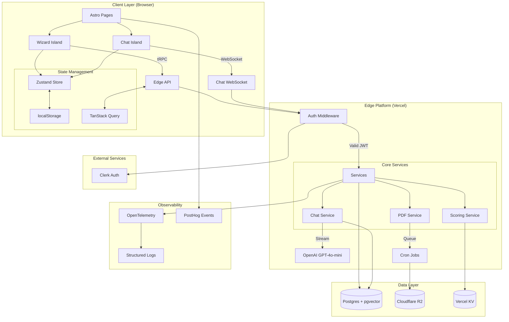
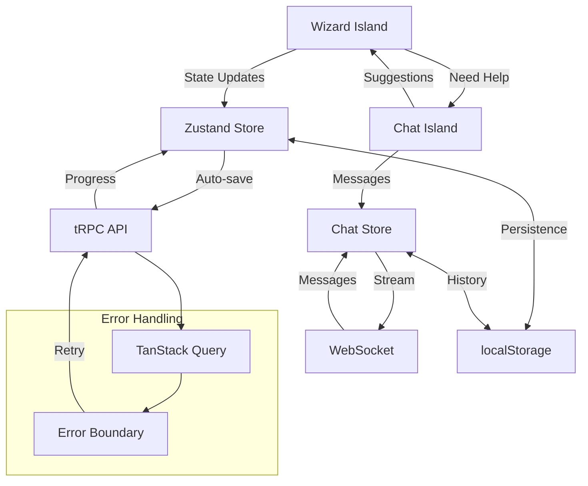
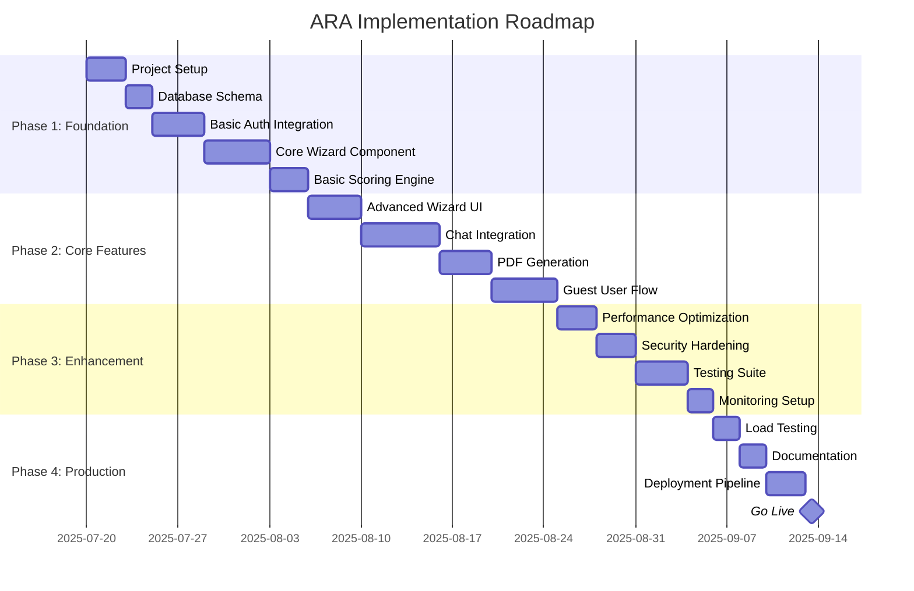

# Agent Readiness Audit - System Design

**Generated by SuperClaude `/sc:design` command**  
**Date**: July 20, 2025  
**Source**: TRD.md analysis  

---

## 1. System Architecture Design

### 1.1 Enhanced Architecture Diagram



### 1.2 System Boundaries & Responsibilities

| Layer | Responsibility | Technology Stack |
|-------|---------------|------------------|
| **Presentation** | UI rendering, user interaction, client state | Astro v4, React 18, Tailwind/DaisyUI |
| **API Gateway** | Request routing, auth, rate limiting | Vercel Edge, tRPC, Clerk middleware |
| **Business Logic** | Scoring, chat orchestration, validation | Node.js Edge runtime, TypeScript |
| **Data Access** | Persistence, queries, migrations | Prisma ORM, Postgres, pgvector |
| **External Integration** | Auth, AI, file storage | Clerk, OpenAI, Cloudflare R2 |
| **Infrastructure** | Deployment, monitoring, scaling | Vercel, GitHub Actions, Terraform |

---

## 2. API Design Specifications

### 2.1 tRPC Router Design

```typescript
// src/server/routers/_app.ts
export const appRouter = router({
  // Wizard Management
  wizard: router({
    saveAnswer: protectedProcedure
      .input(z.object({
        questionKey: z.string(),
        value: z.any(),
        stepId: z.string().optional()
      }))
      .mutation(async ({ input, ctx }) => {
        // Auto-save logic with optimistic updates
      }),
      
    getProgress: publicProcedure
      .input(z.object({
        sessionId: z.string().optional()
      }))
      .query(async ({ input, ctx }) => {
        // Fetch current progress and partial score
      }),
      
    finalSubmit: protectedProcedure
      .input(z.object({
        sessionId: z.string()
      }))
      .mutation(async ({ input, ctx }) => {
        // Validate, score, and enqueue PDF generation
      })
  }),
  
  // Chat Management
  chat: router({
    sendMessage: publicProcedure
      .input(z.object({
        message: z.string(),
        sessionId: z.string(),
        stepContext: z.string().optional()
      }))
      .mutation(async ({ input, ctx }) => {
        // Stream response from OpenAI
      }),
      
    getHistory: publicProcedure
      .input(z.object({
        sessionId: z.string(),
        limit: z.number().default(50)
      }))
      .query(async ({ input, ctx }) => {
        // Fetch chat history with pagination
      })
  }),
  
  // Report Management
  reports: router({
    getReport: protectedProcedure
      .input(z.object({
        sessionId: z.string()
      }))
      .query(async ({ input, ctx }) => {
        // Return signed URL for PDF download
      }),
      
    getStatus: protectedProcedure
      .input(z.object({
        sessionId: z.string()
      }))
      .query(async ({ input, ctx }) => {
        // Check PDF generation status
      })
  })
});
```

### 2.2 Authentication Middleware Design

```typescript
// src/server/middleware/auth.ts
export const withAuth = (options: {
  requireAuth?: boolean;
  allowGuest?: boolean;
}) => {
  return async (req: NextRequest, ctx: Context) => {
    const authHeader = req.headers.get('authorization');
    const anonymousId = req.headers.get('x-anonymous-id');
    
    if (authHeader?.startsWith('Bearer ')) {
      // Validate Clerk JWT
      const token = authHeader.substring(7);
      const session = await verifyToken(token);
      
      if (session) {
        ctx.user = { id: session.userId, type: 'authenticated' };
        return;
      }
    }
    
    if (options.allowGuest && anonymousId) {
      // Allow guest with anonymous ID
      ctx.user = { id: anonymousId, type: 'guest' };
      return;
    }
    
    if (options.requireAuth) {
      throw new TRPCError({
        code: 'UNAUTHORIZED',
        message: 'Authentication required'
      });
    }
  };
};
```

### 2.3 Rate Limiting Strategy

```typescript
// src/server/middleware/rateLimit.ts
export const createRateLimit = (config: {
  windowMs: number;
  maxRequests: number;
  keyGenerator: (req: Request) => string;
}) => {
  return async (req: Request) => {
    const key = config.keyGenerator(req);
    const redis = new Redis(process.env.UPSTASH_REDIS_URL);
    
    const current = await redis.incr(key);
    if (current === 1) {
      await redis.expire(key, config.windowMs / 1000);
    }
    
    if (current > config.maxRequests) {
      throw new TRPCError({
        code: 'TOO_MANY_REQUESTS',
        message: 'Rate limit exceeded'
      });
    }
  };
};
```

---

## 3. Component Architecture Design

### 3.1 Frontend Component Hierarchy

```
src/
├── pages/
│   ├── index.astro          # Landing page
│   ├── wizard.astro         # Wizard container page
│   └── report/[id].astro    # Report display page
├── components/
│   ├── islands/
│   │   ├── WizardIsland.tsx    # Main wizard React island
│   │   └── ChatIsland.tsx      # Chat drawer React island
│   ├── wizard/
│   │   ├── WizardStep.tsx      # Individual step component
│   │   ├── ProgressBar.tsx     # Progress indicator
│   │   ├── StepNavigation.tsx  # Next/back buttons
│   │   └── FieldComponents/    # Input field components
│   ├── chat/
│   │   ├── ChatDrawer.tsx      # Drawer container
│   │   ├── MessageList.tsx     # Message history
│   │   ├── MessageInput.tsx    # User input
│   │   ├── SuggestedChips.tsx  # Canned prompts
│   │   └── AutofillSuggestion.tsx # LLM suggestions
│   └── shared/
│       ├── AuthGuard.tsx       # Authentication wrapper
│       ├── LoadingSpinner.tsx  # Loading states
│       └── ErrorBoundary.tsx   # Error handling
├── stores/
│   ├── wizardStore.ts         # Zustand wizard state
│   ├── chatStore.ts           # Chat state management
│   └── authStore.ts           # Auth state
└── hooks/
    ├── useWizardProgress.ts   # Progress tracking
    ├── useChatStream.ts       # WebSocket chat
    └── useAutoSave.ts         # Auto-save logic
```

### 3.2 State Management Architecture

```typescript
// src/stores/wizardStore.ts
interface WizardState {
  // Current wizard state
  currentStep: number;
  totalSteps: number;
  answers: Record<string, any>;
  sessionId: string | null;
  
  // Progress tracking
  completedSteps: Set<number>;
  validationErrors: Record<string, string>;
  isDirty: boolean;
  lastSaved: Date | null;
  
  // Actions
  setAnswer: (key: string, value: any) => void;
  nextStep: () => void;
  prevStep: () => void;
  goToStep: (step: number) => void;
  autoSave: () => Promise<void>;
  loadProgress: () => Promise<void>;
  submitWizard: () => Promise<void>;
}

// src/stores/chatStore.ts
interface ChatState {
  // Chat state
  isOpen: boolean;
  messages: ChatMessage[];
  isStreaming: boolean;
  currentStepContext: string | null;
  
  // WebSocket connection
  connectionStatus: 'connected' | 'disconnected' | 'connecting';
  
  // Actions
  openChat: (stepContext?: string) => void;
  closeChat: () => void;
  sendMessage: (content: string) => void;
  acceptSuggestion: (suggestion: any) => void;
  clearHistory: () => void;
}

// src/stores/authStore.ts
interface AuthState {
  // User state
  user: User | null;
  isAuthenticated: boolean;
  isGuest: boolean;
  anonymousId: string | null;
  
  // Session management
  sessionExpiry: Date | null;
  
  // Actions
  signIn: () => Promise<void>;
  signOut: () => void;
  convertGuestToUser: () => Promise<void>;
  refreshSession: () => Promise<void>;
}
```

### 3.3 Component Communication Patterns



---

## 4. Service Layer Design

### 4.1 Scoring Service Architecture

```typescript
// src/services/scoring/scoringEngine.ts
interface ScoringConfig {
  pillars: {
    [pillarName: string]: {
      weight: number;
      questions: {
        [questionKey: string]: {
          weight: number;
          scoringFunction: 'linear' | 'exponential' | 'threshold';
          maxScore: number;
        };
      };
    };
  };
}

class ScoringEngine {
  private config: ScoringConfig;
  
  constructor(config: ScoringConfig) {
    this.config = config;
  }
  
  calculateScore(answers: Record<string, any>): ScoringResult {
    const pillarScores = Object.entries(this.config.pillars).map(
      ([pillarName, pillarConfig]) => {
        const questionScores = Object.entries(pillarConfig.questions)
          .map(([questionKey, questionConfig]) => {
            const answer = answers[questionKey];
            return this.scoreQuestion(answer, questionConfig);
          });
        
        const pillarScore = this.aggregateScores(questionScores, pillarConfig.weight);
        
        return {
          pillar: pillarName,
          score: pillarScore,
          maxScore: 100,
          questions: questionScores
        };
      }
    );
    
    const totalScore = this.calculateTotalScore(pillarScores);
    
    return {
      total: totalScore,
      pillars: pillarScores,
      calculatedAt: new Date()
    };
  }
  
  private scoreQuestion(answer: any, config: QuestionConfig): number {
    switch (config.scoringFunction) {
      case 'linear':
        return this.linearScore(answer, config);
      case 'exponential':
        return this.exponentialScore(answer, config);
      case 'threshold':
        return this.thresholdScore(answer, config);
      default:
        throw new Error(`Unknown scoring function: ${config.scoringFunction}`);
    }
  }
}
```

### 4.2 Chat Service Design

```typescript
// src/services/chat/chatService.ts
class ChatService {
  private openai: OpenAI;
  private db: PrismaClient;
  
  async streamChatResponse(params: {
    message: string;
    sessionId: string;
    stepContext?: string;
    userId?: string;
  }): Promise<ReadableStream> {
    
    // Build context from current step and history
    const context = await this.buildContext(params);
    
    // Create OpenAI stream
    const stream = await this.openai.chat.completions.create({
      model: 'gpt-4o-mini',
      messages: [
        { role: 'system', content: this.buildSystemPrompt(context) },
        ...context.history,
        { role: 'user', content: params.message }
      ],
      stream: true,
      functions: [
        {
          name: 'ask_clarifying_question',
          description: 'Ask user for more specific information'
        },
        {
          name: 'persist_answer',
          description: 'Suggest autofill for wizard field'
        }
      ]
    });
    
    // Transform and persist messages
    return this.transformStream(stream, params.sessionId);
  }
  
  private async buildContext(params: any): Promise<ChatContext> {
    // Fetch chat history
    const history = await this.db.chatMessage.findMany({
      where: { auditSessionId: params.sessionId },
      orderBy: { createdAt: 'asc' },
      take: 20 // Token limit consideration
    });
    
    // Get current wizard progress
    const progress = await this.db.auditSession.findUnique({
      where: { id: params.sessionId },
      include: { answers: true }
    });
    
    return {
      stepContext: params.stepContext,
      currentAnswers: progress?.answers || [],
      chatHistory: history,
      userType: params.userId ? 'authenticated' : 'guest'
    };
  }
}
```

### 4.3 PDF Generation Service

```typescript
// src/services/pdf/pdfService.ts
class PDFService {
  private queue: Queue<PDFJob>;
  private storage: R2Storage;
  
  async enqueuePDFGeneration(params: {
    sessionId: string;
    userId: string;
    scoringResult: ScoringResult;
  }): Promise<string> {
    
    const jobId = generateId();
    
    await this.queue.add('generate-pdf', {
      jobId,
      sessionId: params.sessionId,
      userId: params.userId,
      scoringResult: params.scoringResult,
      template: 'audit-report',
      priority: 'normal'
    });
    
    return jobId;
  }
  
  async processPDFJob(job: PDFJob): Promise<void> {
    try {
      // Render HTML template
      const html = await this.renderTemplate(job.data);
      
      // Generate PDF with Puppeteer
      const pdf = await this.generatePDF(html);
      
      // Upload to R2
      const key = `reports/${job.data.sessionId}.pdf`;
      await this.storage.upload(key, pdf);
      
      // Update database status
      await this.updateJobStatus(job.id, 'completed', key);
      
    } catch (error) {
      await this.updateJobStatus(job.id, 'failed', null, error);
      throw error;
    }
  }
  
  async getSignedURL(sessionId: string): Promise<string> {
    const key = `reports/${sessionId}.pdf`;
    return this.storage.getSignedURL(key, { expiresIn: 7 * 24 * 60 * 60 }); // 7 days
  }
}
```

---

## 5. Database Design & Optimization

### 5.1 Enhanced Prisma Schema

```prisma
// Enhanced schema with optimization and indexing
generator client {
  provider = "prisma-client-js"
  previewFeatures = ["postgresqlExtensions"]
}

datasource db {
  provider = "postgresql"
  url      = env("DATABASE_URL")
  extensions = [pgvector]
}

model User {
  id           String   @id @default(uuid())
  clerkId      String   @unique
  email        String?
  firstName    String?
  lastName     String?
  
  // Timestamps
  createdAt    DateTime @default(now())
  updatedAt    DateTime @updatedAt
  lastLoginAt  DateTime?
  
  // Relations
  auditSessions AuditSession[]
  
  // Indexes
  @@map("users")
  @@index([clerkId])
  @@index([email])
  @@index([createdAt])
}

model AuditSession {
  id           String   @id @default(uuid())
  
  // Identity (either userId OR anonymousId)
  userId       String?
  anonymousId  String?  @unique
  
  // Status and scoring
  status       AuditStatus @default(DRAFT)
  score        Decimal?    @db.Decimal(5,2) // 0.00 to 999.99
  scoringData  Json?       // Detailed scoring breakdown
  
  // Metadata
  startedAt    DateTime  @default(now())
  completedAt  DateTime?
  updatedAt    DateTime  @updatedAt
  
  // PDF generation
  pdfJobId     String?
  pdfUrl       String?
  pdfGeneratedAt DateTime?
  
  // Relations
  user         User?            @relation(fields: [userId], references: [id], onDelete: Cascade)
  answers      AuditAnswer[]
  chatMessages ChatMessage[]
  
  // Indexes and constraints
  @@map("audit_sessions")
  @@index([userId])
  @@index([anonymousId])
  @@index([status])
  @@index([startedAt])
  @@unique([anonymousId], name: "unique_anonymous_session")
}

enum AuditStatus {
  DRAFT         // In progress
  SUBMITTED     // User submitted, pending scoring
  SCORED        // Scoring complete
  REPORT_READY  // PDF generated
  ARCHIVED      // Soft deleted
}

model AuditAnswer {
  id           String   @id @default(uuid())
  
  // Session relation
  auditSessionId String
  auditSession   AuditSession @relation(fields: [auditSessionId], references: [id], onDelete: Cascade)
  
  // Question data
  questionKey  String   // e.g., "company_size", "tech_stack"
  stepId       String   // Which wizard step
  value        Json     // Flexible answer storage
  
  // Metadata
  createdAt    DateTime @default(now())
  updatedAt    DateTime @updatedAt
  
  // Composite indexes
  @@map("audit_answers")
  @@unique([auditSessionId, questionKey], name: "unique_session_question")
  @@index([auditSessionId])
  @@index([questionKey])
  @@index([stepId])
}

model ChatMessage {
  id           String   @id @default(uuid())
  
  // Session relation
  auditSessionId String
  auditSession   AuditSession @relation(fields: [auditSessionId], references: [id], onDelete: Cascade)
  
  // Message data
  role         MessageRole
  content      Text
  metadata     Json?        // Function calls, step context, etc.
  
  // Token tracking
  tokens       Int          @default(0)
  
  // Vector embedding for semantic search
  embedding    Unsupported("vector(1536)")?
  
  // Timestamps
  createdAt    DateTime @default(now())
  
  // Indexes
  @@map("chat_messages")
  @@index([auditSessionId, createdAt])
  @@index([role])
  @@index([createdAt])
  @@index([embedding], type: Ivfflat, map: "chat_messages_embedding_idx")
}

enum MessageRole {
  USER
  ASSISTANT
  SYSTEM
  FUNCTION
}

model PDFJob {
  id           String   @id @default(uuid())
  
  // Job data
  sessionId    String
  status       JobStatus @default(PENDING)
  priority     JobPriority @default(NORMAL)
  
  // Processing data
  templateData Json
  errorMessage String?
  retryCount   Int      @default(0)
  
  // File storage
  r2Key        String?
  signedUrl    String?
  urlExpiresAt DateTime?
  
  // Timestamps
  createdAt    DateTime @default(now())
  startedAt    DateTime?
  completedAt  DateTime?
  
  // Indexes
  @@map("pdf_jobs")
  @@index([sessionId])
  @@index([status, priority])
  @@index([createdAt])
}

enum JobStatus {
  PENDING
  PROCESSING
  COMPLETED
  FAILED
  CANCELLED
}

enum JobPriority {
  LOW
  NORMAL
  HIGH
  URGENT
}

// Configuration table for hot-reloading scoring weights
model ScoringConfig {
  id        String   @id @default("default")
  version   String
  config    Json     // Scoring weights and rules
  isActive  Boolean  @default(false)
  createdAt DateTime @default(now())
  createdBy String?
  
  @@map("scoring_configs")
  @@index([isActive])
  @@index([version])
}
```

### 5.2 Database Optimization Strategies

```sql
-- Performance optimization indexes
CREATE INDEX CONCURRENTLY idx_audit_sessions_user_status 
ON audit_sessions(user_id, status) 
WHERE user_id IS NOT NULL;

CREATE INDEX CONCURRENTLY idx_audit_sessions_anonymous_active 
ON audit_sessions(anonymous_id, updated_at) 
WHERE status IN ('DRAFT', 'SUBMITTED');

CREATE INDEX CONCURRENTLY idx_chat_messages_session_recent 
ON chat_messages(audit_session_id, created_at DESC) 
WHERE created_at > NOW() - INTERVAL '30 days';

-- Partial indexes for common queries
CREATE INDEX CONCURRENTLY idx_pdf_jobs_pending 
ON pdf_jobs(created_at) 
WHERE status = 'PENDING';

-- Vector similarity search optimization
CREATE INDEX CONCURRENTLY chat_messages_embedding_cosine_idx 
ON chat_messages 
USING ivfflat (embedding vector_cosine_ops) 
WITH (lists = 100);
```

### 5.3 Data Migration Strategy

```typescript
// Guest user conversion migration
export async function convertGuestToUser(
  db: PrismaClient,
  anonymousId: string,
  userId: string
): Promise<void> {
  
  await db.$transaction(async (tx) => {
    // Find existing guest session
    const guestSession = await tx.auditSession.findUnique({
      where: { anonymousId },
      include: { answers: true, chatMessages: true }
    });
    
    if (!guestSession) {
      throw new Error('Guest session not found');
    }
    
    // Check if user already has a session
    const existingUserSession = await tx.auditSession.findFirst({
      where: { userId, status: 'DRAFT' }
    });
    
    if (existingUserSession) {
      // Merge sessions: guest data takes precedence
      await tx.auditAnswer.updateMany({
        where: { auditSessionId: existingUserSession.id },
        data: { auditSessionId: guestSession.id }
      });
      
      await tx.auditSession.delete({
        where: { id: existingUserSession.id }
      });
    }
    
    // Convert guest session to user session
    await tx.auditSession.update({
      where: { id: guestSession.id },
      data: {
        userId,
        anonymousId: null,
        updatedAt: new Date()
      }
    });
    
    // Update chat messages with user context
    await tx.chatMessage.updateMany({
      where: { auditSessionId: guestSession.id },
      data: {
        metadata: {
          userConverted: true,
          convertedAt: new Date()
        }
      }
    });
  });
}
```

---

## 6. Security Design Patterns

### 6.1 Authentication Flow Architecture

```typescript
// src/middleware/auth.ts
export class AuthenticationService {
  
  async validateRequest(req: Request): Promise<AuthContext> {
    const authHeader = req.headers.get('authorization');
    const anonymousId = req.headers.get('x-anonymous-id');
    
    // Try authenticated user first
    if (authHeader?.startsWith('Bearer ')) {
      const token = authHeader.substring(7);
      const session = await this.verifyClerkToken(token);
      
      if (session?.userId) {
        return {
          type: 'authenticated',
          userId: session.userId,
          sessionId: await this.getOrCreateSession(session.userId),
          permissions: await this.getUserPermissions(session.userId)
        };
      }
    }
    
    // Fall back to guest user
    if (anonymousId && this.isValidUUID(anonymousId)) {
      const sessionId = await this.getOrCreateGuestSession(anonymousId);
      
      return {
        type: 'guest',
        anonymousId,
        sessionId,
        permissions: ['read_own_session', 'write_own_session', 'chat']
      };
    }
    
    throw new UnauthorizedError('Invalid authentication');
  }
  
  async getOrCreateSession(userId: string): Promise<string> {
    const existing = await db.auditSession.findFirst({
      where: { userId, status: 'DRAFT' },
      orderBy: { updatedAt: 'desc' }
    });
    
    if (existing) {
      return existing.id;
    }
    
    const session = await db.auditSession.create({
      data: {
        userId,
        status: 'DRAFT'
      }
    });
    
    return session.id;
  }
}
```

### 6.2 Data Encryption Strategy

```typescript
// src/services/encryption.ts
import { pgCrypto } from '@prisma/client/runtime';

export class EncryptionService {
  private encryptionKey: string;
  
  constructor() {
    this.encryptionKey = process.env.ENCRYPTION_KEY!;
    if (!this.encryptionKey) {
      throw new Error('ENCRYPTION_KEY environment variable required');
    }
  }
  
  // Encrypt PII fields before database storage
  async encryptPII(data: any): Promise<any> {
    const encrypted = { ...data };
    
    const piiFields = ['email', 'firstName', 'lastName', 'companyName'];
    
    for (const field of piiFields) {
      if (encrypted[field]) {
        encrypted[field] = await this.encrypt(encrypted[field]);
      }
    }
    
    return encrypted;
  }
  
  private async encrypt(value: string): Promise<string> {
    // Use pgcrypto for database-level encryption
    return pgCrypto.encrypt(value, this.encryptionKey);
  }
  
  private async decrypt(encryptedValue: string): Promise<string> {
    return pgCrypto.decrypt(encryptedValue, this.encryptionKey);
  }
}
```

### 6.3 Rate Limiting Implementation

```typescript
// src/middleware/rateLimit.ts
export class RateLimitService {
  private redis: Redis;
  
  constructor() {
    this.redis = new Redis(process.env.UPSTASH_REDIS_URL!);
  }
  
  async checkRateLimit(key: string, limit: number, windowMs: number): Promise<RateLimitResult> {
    const window = Math.floor(Date.now() / windowMs);
    const redisKey = `rate_limit:${key}:${window}`;
    
    const current = await this.redis.incr(redisKey);
    
    if (current === 1) {
      await this.redis.expire(redisKey, Math.ceil(windowMs / 1000));
    }
    
    const remaining = Math.max(0, limit - current);
    const resetTime = (window + 1) * windowMs;
    
    return {
      allowed: current <= limit,
      limit,
      remaining,
      resetTime,
      retryAfter: current > limit ? resetTime - Date.now() : null
    };
  }
  
  // Different rate limits for different operations
  async checkWizardRateLimit(userId: string): Promise<void> {
    const result = await this.checkRateLimit(
      `wizard:${userId}`,
      100, // 100 saves per hour
      60 * 60 * 1000
    );
    
    if (!result.allowed) {
      throw new RateLimitError('Too many wizard updates', result.retryAfter);
    }
  }
  
  async checkChatRateLimit(userId: string): Promise<void> {
    const result = await this.checkRateLimit(
      `chat:${userId}`,
      20, // 20 messages per minute
      60 * 1000
    );
    
    if (!result.allowed) {
      throw new RateLimitError('Too many chat messages', result.retryAfter);
    }
  }
}
```

---

## 7. Implementation Roadmap & Patterns

### 7.1 Development Phases



### 7.2 Code Organization Patterns

```
project-root/
├── src/
│   ├── components/          # Reusable UI components
│   ├── pages/              # Astro pages
│   ├── islands/            # React islands
│   ├── stores/             # Zustand state management
│   ├── services/           # Business logic services
│   ├── server/             # tRPC routers and middleware
│   ├── types/              # TypeScript type definitions
│   ├── utils/              # Utility functions
│   └── config/             # Configuration files
├── prisma/
│   ├── schema.prisma       # Database schema
│   ├── migrations/         # Database migrations
│   └── seed.ts            # Database seeding
├── tests/
│   ├── unit/              # Unit tests
│   ├── integration/       # Integration tests
│   └── e2e/               # End-to-end tests
├── docs/
│   ├── api/               # API documentation
│   ├── architecture/      # Architecture decisions
│   └── deployment/        # Deployment guides
└── infrastructure/
    ├── terraform/         # Infrastructure as code
    └── scripts/           # Deployment scripts
```

### 7.3 Key Implementation Patterns

**Error Handling Pattern**
```typescript
// Centralized error handling with context
export class AppError extends Error {
  constructor(
    message: string,
    public code: string,
    public statusCode: number = 500,
    public context?: any
  ) {
    super(message);
    this.name = 'AppError';
  }
}

// Usage in services
try {
  await this.scoringService.calculateScore(answers);
} catch (error) {
  throw new AppError(
    'Scoring calculation failed',
    'SCORING_ERROR',
    500,
    { sessionId, error: error.message }
  );
}
```

**Caching Pattern**
```typescript
// Service-level caching with TTL
export class CachedScoringService {
  private cache = new Map<string, { data: any; expires: number }>();
  
  async getScore(sessionId: string): Promise<ScoringResult> {
    const cacheKey = `score:${sessionId}`;
    const cached = this.cache.get(cacheKey);
    
    if (cached && cached.expires > Date.now()) {
      return cached.data;
    }
    
    const score = await this.calculateScore(sessionId);
    
    this.cache.set(cacheKey, {
      data: score,
      expires: Date.now() + (5 * 60 * 1000) // 5 minutes
    });
    
    return score;
  }
}
```

**Monitoring Pattern**
```typescript
// OpenTelemetry integration
import { trace } from '@opentelemetry/api';

export function withTracing<T>(
  operationName: string,
  fn: () => Promise<T>
): Promise<T> {
  const tracer = trace.getTracer('ara-app');
  
  return tracer.startActiveSpan(operationName, async (span) => {
    try {
      const result = await fn();
      span.setStatus({ code: 1 }); // OK
      return result;
    } catch (error) {
      span.setStatus({ code: 2, message: error.message }); // ERROR
      span.recordException(error);
      throw error;
    } finally {
      span.end();
    }
  });
}
```

---

*This comprehensive system design provides detailed specifications for implementing the Agent Readiness Audit application according to the TRD requirements. Each section includes concrete code examples, architectural patterns, and implementation guidelines for a production-ready system.*

<function_calls>
<invoke name="TodoWrite">
<parameter name="todos">[{"id": "1", "content": "Analyze TRD requirements and constraints", "status": "completed", "priority": "high"}, {"id": "2", "content": "Design detailed system architecture", "status": "completed", "priority": "high"}, {"id": "3", "content": "Create API interface specifications", "status": "in_progress", "priority": "high"}, {"id": "4", "content": "Design component architecture and state flow", "status": "pending", "priority": "medium"}, {"id": "5", "content": "Generate implementation guides and patterns", "status": "pending", "priority": "medium"}]